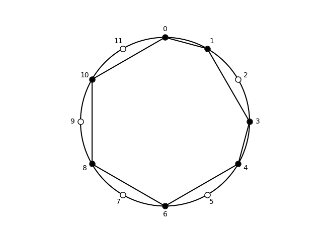

## Subsets of acoustic, [0, 1, 3, 4, 6, 8, 10]

| pcs | Forte name | prime | sia | ic Vector | Common |
| --- | --- | --- | --- | --- | --- |
|  <013468A>  |  7-34  |  <013468A>  |  <1-2-1-2-2-2-2>  |  <254442>  |  melodic minor ascending scale  |

## Subsets of cardinality: 3

| pcs | Forte name | prime | sia | ic Vector | Common |
| --- | --- | --- | --- | --- | --- |
|  <013>  |  3-2A  |  <013>  |  <1-2-9>  |  <111000>  |  phrygian trichord  |
|  <014>  |  3-3A  |  <014>  |  <1-3-8>  |  <101100>  |  major-minor trichord  |
|  <016>  |  3-5A  |  <016>  |  <1-5-6>  |  <100011>  |  tritone-fourth  |
|  <018>  |  3-4B  |  <015>  |  <1-7-4>  |  <100110>  |  incomplete major-seventh chord  |
|  <01A>  |  3-2B  |  <013>  |  <1-9-2>  |  <111000>  |  minor trichord  |
|  <034>  |  3-3B  |  <014>  |  <3-1-8>  |  <101100>  |  major-minor trichord  |
|  <036>  |  3-10  |  <036>  |  <3-3-6>  |  <002001>  |  diminished triad  |
|  <038>  |  3-11B  |  <037>  |  <3-5-4>  |  <001110>  |  major triad  |
|  <03A>  |  3-7A  |  <025>  |  <3-7-2>  |  <011010>  |  incomplete minor-seventh chord  |
|  <046>  |  3-8B  |  <026>  |  <4-2-6>  |  <010101>  |  incomplete half-diminished seventh chord  |
|  <048>  |  3-12  |  <048>  |  <4-4-4>  |  <000300>  |  augmented triad  |
|  <04A>  |  3-8A  |  <026>  |  <4-6-2>  |  <010101>  |  incomplete dominant-seventh chord  |
|  <068>  |  3-8A  |  <026>  |  <6-2-4>  |  <010101>  |  incomplete dominant-seventh chord  |
|  <06A>  |  3-8B  |  <026>  |  <6-4-2>  |  <010101>  |  incomplete half-diminished seventh chord  |
|  <08A>  |  3-6  |  <024>  |  <8-2-2>  |  <020100>  |  whole-tone trichord  |
|  <134>  |  3-2B  |  <013>  |  <2-1-9>  |  <111000>  |  minor trichord  |
|  <136>  |  3-7A  |  <025>  |  <2-3-7>  |  <011010>  |  incomplete minor-seventh chord  |
|  <138>  |  3-9  |  <027>  |  <2-5-5>  |  <010020>  |  quartal trichord  |
|  <13A>  |  3-7B  |  <025>  |  <2-7-3>  |  <011010>  |  incomplete dominant-seventh chord  |
|  <146>  |  3-7B  |  <025>  |  <3-2-7>  |  <011010>  |  incomplete dominant-seventh chord  |
|  <148>  |  3-11A  |  <037>  |  <3-4-5>  |  <001110>  |  minor triad  |
|  <14A>  |  3-10  |  <036>  |  <3-6-3>  |  <002001>  |  diminished triad  |
|  <168>  |  3-9  |  <027>  |  <5-2-5>  |  <010020>  |  quartal trichord  |
|  <16A>  |  3-11B  |  <037>  |  <5-4-3>  |  <001110>  |  major triad  |
|  <18A>  |  3-7A  |  <025>  |  <7-2-3>  |  <011010>  |  incomplete minor-seventh chord  |
|  <346>  |  3-2A  |  <013>  |  <1-2-9>  |  <111000>  |  phrygian trichord  |
|  <348>  |  3-4A  |  <015>  |  <1-4-7>  |  <100110>  |  incomplete major-seventh chord  |
|  <34A>  |  3-5B  |  <016>  |  <1-6-5>  |  <100011>  |  tritone-fourth  |
|  <368>  |  3-7B  |  <025>  |  <3-2-7>  |  <011010>  |  incomplete dominant-seventh chord  |
|  <36A>  |  3-11A  |  <037>  |  <3-4-5>  |  <001110>  |  minor triad  |
|  <38A>  |  3-9  |  <027>  |  <5-2-5>  |  <010020>  |  quartal trichord  |
|  <468>  |  3-6  |  <024>  |  <2-2-8>  |  <020100>  |  whole-tone trichord  |
|  <46A>  |  3-8A  |  <026>  |  <2-4-6>  |  <010101>  |  incomplete dominant-seventh chord  |
|  <48A>  |  3-8B  |  <026>  |  <4-2-6>  |  <010101>  |  incomplete half-diminished seventh chord  |
|  <68A>  |  3-6  |  <024>  |  <2-2-8>  |  <020100>  |  whole-tone trichord  |

Summary: 3-2A: 2, 3-2B: 2, 3-3A: 1, 3-3B: 1, 3-4A: 1, 3-4B: 1, 3-5A: 1, 3-5B: 1, 3-6: 3, 3-7A: 3, 3-7B: 3, 3-8A: 3, 3-8B: 3, 3-9: 3, 3-10: 2, 3-11A: 2, 3-11B: 2, 3-12: 1.

## Subsets of cardinality: 4

| pcs | Forte name | prime | sia | ic Vector | Common |
| --- | --- | --- | --- | --- | --- |
|  <0134>  |  4-3  |  <0134>  |  <1-2-1-8>  |  <212100>  |  alternating tetramirror  |
|  <0136>  |  4-13A  |  <0136>  |  <1-2-3-6>  |  <112011>  |  minor-second diminished tetrachord  |
|  <0138>  |  4-14B  |  <0237>  |  <1-2-5-4>  |  <111120>  |  perfect-fourth major tetrachord  |
|  <013A>  |  4-10  |  <0235>  |  <1-2-7-2>  |  <122010>  |  minor tetramirror  |
|  <0146>  |  4-15A  |  <0146>  |  <1-3-2-6>  |  <111111>  |  all-interval tetrachord  |
|  <0148>  |  4-19A  |  <0148>  |  <1-3-4-4>  |  <101310>  |  minor-augmented tetrachord  |
|  <014A>  |  4-12A  |  <0236>  |  <1-3-6-2>  |  <112101>  |  harmonic minor tetrachord  |
|  <0168>  |  4-16B  |  <0157>  |  <1-5-2-4>  |  <110121>  |  tritone quartal tetrachord  |
|  <016A>  |  4-29B  |  <0137>  |  <1-5-4-2>  |  <111111>  |  all-interval tetrachord  |
|  <018A>  |  4-11B  |  <0135>  |  <1-7-2-2>  |  <121110>  |  lydian tetrachord  |
|  <0346>  |  4-12B  |  <0236>  |  <3-1-2-6>  |  <112101>  |  major-third diminished tetrachord  |
|  <0348>  |  4-19B  |  <0148>  |  <3-1-4-4>  |  <101310>  |  augmented major tetrachord  |
|  <034A>  |  4-15B  |  <0146>  |  <3-1-6-2>  |  <111111>  |  all-interval tetrachord  |
|  <0368>  |  4-27B  |  <0258>  |  <3-3-2-4>  |  <012111>  |  dominant seventh chord  |
|  <036A>  |  4-27A  |  <0258>  |  <3-3-4-2>  |  <012111>  |  half-diminished seventh chord  |
|  <038A>  |  4-22A  |  <0247>  |  <3-5-2-2>  |  <021120>  |  major-second major tetrachord  |
|  <0468>  |  4-24  |  <0248>  |  <4-2-2-4>  |  <020301>  |  augmented seventh chord  |
|  <046A>  |  4-25  |  <0268>  |  <4-2-4-2>  |  <020202>  |  French augmented sixth chord  |
|  <048A>  |  4-24  |  <0248>  |  <4-4-2-2>  |  <020301>  |  augmented seventh chord  |
|  <068A>  |  4-21  |  <0246>  |  <6-2-2-2>  |  <030201>  |  whole-tone tetramirror  |
|  <1346>  |  4-10  |  <0235>  |  <2-1-2-7>  |  <122010>  |  minor tetramirror  |
|  <1348>  |  4-14A  |  <0237>  |  <2-1-4-5>  |  <111120>  |  major-second minor tetrachord  |
|  <134A>  |  4-13B  |  <0136>  |  <2-1-6-3>  |  <112011>  |  perfect-fourth diminished tetrachord  |
|  <1368>  |  4-23  |  <0257>  |  <2-3-2-5>  |  <021030>  |  quartal tetramirror  |
|  <136A>  |  4-26  |  <0358>  |  <2-3-4-3>  |  <012120>  |  enharmonic equivalent to minor seventh chord  |
|  <138A>  |  4-23  |  <0257>  |  <2-5-2-3>  |  <021030>  |  quartal tetramirror  |
|  <1468>  |  4-22B  |  <0247>  |  <3-2-2-5>  |  <021120>  |  perfect-fourth minor tetrachord  |
|  <146A>  |  4-27B  |  <0258>  |  <3-2-4-3>  |  <012111>  |  dominant seventh chord  |
|  <148A>  |  4-27A  |  <0258>  |  <3-4-2-3>  |  <012111>  |  half-diminished seventh chord  |
|  <168A>  |  4-22A  |  <0247>  |  <5-2-2-3>  |  <021120>  |  major-second major tetrachord  |
|  <3468>  |  4-11A  |  <0135>  |  <1-2-2-7>  |  <121110>  |  phrygian tetrachord  |
|  <346A>  |  4-29A  |  <0137>  |  <1-2-4-5>  |  <111111>  |  all-interval tetrachord  |
|  <348A>  |  4-16A  |  <0157>  |  <1-4-2-5>  |  <110121>  |  minor-second quartal tetrachord  |
|  <368A>  |  4-22B  |  <0247>  |  <3-2-2-5>  |  <021120>  |  perfect-fourth minor tetrachord  |
|  <468A>  |  4-21  |  <0246>  |  <2-2-2-6>  |  <030201>  |  whole-tone tetramirror  |

Summary: 4-3: 1, 4-10: 2, 4-11A: 1, 4-11B: 1, 4-12A: 1, 4-12B: 1, 4-13A: 1, 4-13B: 1, 4-14A: 1, 4-14B: 1, 4-15A: 1, 4-15B: 1, 4-16A: 1, 4-16B: 1, 4-19A: 1, 4-19B: 1, 4-21: 2, 4-22A: 2, 4-22B: 2, 4-23: 2, 4-24: 2, 4-25: 1, 4-26: 1, 4-27A: 2, 4-27B: 2, 4-29A: 1, 4-29B: 1.

## Subsets of cardinality: 5

| pcs | Forte name | prime | sia | ic Vector | Common |
| --- | --- | --- | --- | --- | --- |
|  <01346>  |  5-10A  |  <01346>  |  <1-2-1-2-6>  |  <223111>  |  alternating pentachord  |
|  <01348>  |  5-17  |  <01348>  |  <1-2-1-4-4>  |  <212320>  |  minor-major ninth chord  |
|  <0134A>  |  5-10B  |  <01346>  |  <1-2-1-6-2>  |  <223111>  |  alternating pentachord  |
|  <01368>  |  5-29A  |  <01368>  |  <1-2-3-2-4>  |  <122131>  |  Kumoi pentachord  |
|  <0136A>  |  5-25A  |  <02358>  |  <1-2-3-4-2>  |  <123121>  |  diminished-major ninth chord  |
|  <0138A>  |  5-23B  |  <02357>  |  <1-2-5-2-2>  |  <132130>  |  major pentachord  |
|  <01468>  |  5-30A  |  <01468>  |  <1-3-2-2-4>  |  <121321>  |  enigmatic pentachord  |
|  <0146A>  |  5-28A  |  <02368>  |  <1-3-2-4-2>  |  <122212>  |  augmented-sixth pentachord  |
|  <0148A>  |  5-26A  |  <02458>  |  <1-3-4-2-2>  |  <122311>  |  diminished-augmented ninth chord  |
|  <0168A>  |  5-24B  |  <01357>  |  <1-5-2-2-2>  |  <131221>  |  lydian pentachord  |
|  <03468>  |  5-26B  |  <02458>  |  <3-1-2-2-4>  |  <122311>  |  augmented-diminished ninth chord  |
|  <0346A>  |  5-28B  |  <02368>  |  <3-1-2-4-2>  |  <122212>  |  Javanese pentatonic  |
|  <0348A>  |  5-30B  |  <01468>  |  <3-1-4-2-2>  |  <121321>  |  enigmatic pentachord  |
|  <0368A>  |  5-34  |  <02469>  |  <3-3-2-2-2>  |  <032221>  |  dominant-ninth  |
|  <0468A>  |  5-33  |  <02468>  |  <4-2-2-2-2>  |  <040402>  |  whole-tone pentachord  |
|  <13468>  |  5-23A  |  <02357>  |  <2-1-2-2-5>  |  <132130>  |  dorian pentachord  |
|  <1346A>  |  5-25B  |  <02358>  |  <2-1-2-4-3>  |  <123121>  |  minor-diminished ninth chord  |
|  <1348A>  |  5-29B  |  <01368>  |  <2-1-4-2-3>  |  <122131>  |  Kumoi pentachord  |
|  <1368A>  |  5-35  |  <02479>  |  <2-3-2-2-3>  |  <032140>  |  major pentatonic  |
|  <1468A>  |  5-34  |  <02469>  |  <3-2-2-2-3>  |  <032221>  |  dominant-ninth  |
|  <3468A>  |  5-24A  |  <01357>  |  <1-2-2-2-5>  |  <131221>  |  phrygian pentachord  |

Summary: 5-10A: 1, 5-10B: 1, 5-17: 1, 5-23A: 1, 5-23B: 1, 5-24A: 1, 5-24B: 1, 5-25A: 1, 5-25B: 1, 5-26A: 1, 5-26B: 1, 5-28A: 1, 5-28B: 1, 5-29A: 1, 5-29B: 1, 5-30A: 1, 5-30B: 1, 5-33: 1, 5-34: 2, 5-35: 1.

## Subsets of cardinality: 6

| pcs | Forte name | prime | sia | ic Vector | Common |
| --- | --- | --- | --- | --- | --- |
|  <013468>  |  6-24A  |  <013468>  |  <1-2-1-2-2-4>  |  <233331>  |  forte class 6-24A  |
|  <01346A>  |  6-23  |  <023568>  |  <1-2-1-2-4-2>  |  <234222>  |  combinatorial RI (RI8)  |
|  <01348A>  |  6-24B  |  <013468>  |  <1-2-1-4-2-2>  |  <233331>  |  melodic-minor hexachord  |
|  <01368A>  |  6-33B  |  <023579>  |  <1-2-3-2-2-2>  |  <143241>  |  dominant-eleventh  |
|  <01468A>  |  6-34B  |  <013579>  |  <1-3-2-2-2-2>  |  <142422>  |  augmented-eleventh  |
|  <03468A>  |  6-34A  |  <013579>  |  <3-1-2-2-2-2>  |  <142422>  |  Scriabin's Mystic-chord  |
|  <13468A>  |  6-33A  |  <023579>  |  <2-1-2-2-2-3>  |  <143241>  |  dorian hexachord  |

Summary: 6-23: 1, 6-24A: 1, 6-24B: 1, 6-33A: 1, 6-33B: 1, 6-34A: 1, 6-34B: 1.

## Supersets of cardinality: 8

| pcs | Forte name | prime | sia | ic Vector | Common |
| --- | --- | --- | --- | --- | --- |
|  <0123468A>  |  8-21  |  <0123468A>  |  <1-1-1-1-2-2-2-2>  |  <474643>  |  forte class 8-21  |
|  <0134568A>  |  8-22B  |  <0123568A>  |  <1-2-1-1-1-2-2-2>  |  <465562>  |  Spanish octatonic scale  |
|  <0134678A>  |  8-27B  |  <0124578A>  |  <1-2-1-2-1-1-2-2>  |  <456553>  |  forte class 8-27B  |
|  <0134689A>  |  8-27A  |  <0124578A>  |  <1-2-1-2-2-1-1-2>  |  <456553>  |  forte class 8-27A  |
|  <013468AB>  |  8-22A  |  <0123568A>  |  <1-2-1-2-2-2-1-1>  |  <465562>  |  forte class 8-22A  |

Summary: 8-21: 1, 8-22A: 1, 8-22B: 1, 8-27A: 1, 8-27B: 1.

## Supersets of cardinality: 9

| pcs | Forte name | prime | sia | ic Vector | Common |
| --- | --- | --- | --- | --- | --- |
|  <01234568A>  |  9-6  |  <01234568A>  |  <1-1-1-1-1-1-2-2-2>  |  <686763>  |  forte class 9-6  |
|  <01234678A>  |  9-8A  |  <01234678A>  |  <1-1-1-1-2-1-1-2-2>  |  <676764>  |  forte class 9-8A  |
|  <01234689A>  |  9-8B  |  <01234678A>  |  <1-1-1-1-2-2-1-1-2>  |  <676764>  |  forte class 9-8B  |
|  <0123468AB>  |  9-6  |  <01234568A>  |  <1-1-1-1-2-2-2-1-1>  |  <686763>  |  forte class 9-6  |
|  <01345678A>  |  9-7B  |  <01234578A>  |  <1-2-1-1-1-1-1-2-2>  |  <677673>  |  forte class 9-7B  |
|  <01345689A>  |  9-11A  |  <01235679A>  |  <1-2-1-1-1-2-1-1-2>  |  <667773>  |  forte class 9-11A  |
|  <0134568AB>  |  9-9  |  <01235678A>  |  <1-2-1-1-1-2-2-1-1>  |  <676683>  |  forte class 9-9  |
|  <01346789A>  |  9-10  |  <01234679A>  |  <1-2-1-2-1-1-1-1-2>  |  <668664>  |  forte class 9-10  |
|  <0134678AB>  |  9-11B  |  <01235679A>  |  <1-2-1-2-1-1-2-1-1>  |  <667773>  |  diminishing nonachord  |
|  <0134689AB>  |  9-7A  |  <01234578A>  |  <1-2-1-2-2-1-1-1-1>  |  <677673>  |  nonatonic blues  |

Summary: 9-6: 2, 9-7A: 1, 9-7B: 1, 9-8A: 1, 9-8B: 1, 9-9: 1, 9-10: 1, 9-11A: 1, 9-11B: 1.

