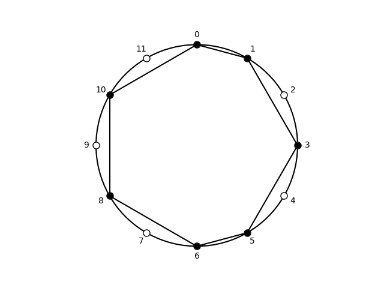

## Subsets of diatonic, [0, 1, 3, 5, 6, 8, 10]

| pcs | Forte name | prime | sia | ic Vector | Common |
| --- | --- | --- | --- | --- | --- |
|  <013568A>  |  7-35  |  <013568A>  |  <1-2-2-1-2-2-2>  |  <254361>  |  major scale  |

## Subsets of cardinality: 3

| pcs | Forte name | prime | sia | ic Vector | Common |
| --- | --- | --- | --- | --- | --- |
|  <013>  |  3-2A  |  <013>  |  <1-2-9>  |  <111000>  |  phrygian trichord  |
|  <015>  |  3-4A  |  <015>  |  <1-4-7>  |  <100110>  |  incomplete major-seventh chord  |
|  <016>  |  3-5A  |  <016>  |  <1-5-6>  |  <100011>  |  tritone-fourth  |
|  <018>  |  3-4B  |  <015>  |  <1-7-4>  |  <100110>  |  incomplete major-seventh chord  |
|  <01A>  |  3-2B  |  <013>  |  <1-9-2>  |  <111000>  |  minor trichord  |
|  <035>  |  3-7B  |  <025>  |  <3-2-7>  |  <011010>  |  incomplete dominant-seventh chord  |
|  <036>  |  3-10  |  <036>  |  <3-3-6>  |  <002001>  |  diminished triad  |
|  <038>  |  3-11B  |  <037>  |  <3-5-4>  |  <001110>  |  major triad  |
|  <03A>  |  3-7A  |  <025>  |  <3-7-2>  |  <011010>  |  incomplete minor-seventh chord  |
|  <056>  |  3-5B  |  <016>  |  <5-1-6>  |  <100011>  |  tritone-fourth  |
|  <058>  |  3-11A  |  <037>  |  <5-3-4>  |  <001110>  |  minor triad  |
|  <05A>  |  3-9  |  <027>  |  <5-5-2>  |  <010020>  |  quartal trichord  |
|  <068>  |  3-8A  |  <026>  |  <6-2-4>  |  <010101>  |  incomplete dominant-seventh chord  |
|  <06A>  |  3-8B  |  <026>  |  <6-4-2>  |  <010101>  |  incomplete half-diminished seventh chord  |
|  <08A>  |  3-6  |  <024>  |  <8-2-2>  |  <020100>  |  whole-tone trichord  |
|  <135>  |  3-6  |  <024>  |  <2-2-8>  |  <020100>  |  whole-tone trichord  |
|  <136>  |  3-7A  |  <025>  |  <2-3-7>  |  <011010>  |  incomplete minor-seventh chord  |
|  <138>  |  3-9  |  <027>  |  <2-5-5>  |  <010020>  |  quartal trichord  |
|  <13A>  |  3-7B  |  <025>  |  <2-7-3>  |  <011010>  |  incomplete dominant-seventh chord  |
|  <156>  |  3-4B  |  <015>  |  <4-1-7>  |  <100110>  |  incomplete major-seventh chord  |
|  <158>  |  3-11B  |  <037>  |  <4-3-5>  |  <001110>  |  major triad  |
|  <15A>  |  3-11A  |  <037>  |  <4-5-3>  |  <001110>  |  minor triad  |
|  <168>  |  3-9  |  <027>  |  <5-2-5>  |  <010020>  |  quartal trichord  |
|  <16A>  |  3-11B  |  <037>  |  <5-4-3>  |  <001110>  |  major triad  |
|  <18A>  |  3-7A  |  <025>  |  <7-2-3>  |  <011010>  |  incomplete minor-seventh chord  |
|  <356>  |  3-2B  |  <013>  |  <2-1-9>  |  <111000>  |  minor trichord  |
|  <358>  |  3-7A  |  <025>  |  <2-3-7>  |  <011010>  |  incomplete minor-seventh chord  |
|  <35A>  |  3-9  |  <027>  |  <2-5-5>  |  <010020>  |  quartal trichord  |
|  <368>  |  3-7B  |  <025>  |  <3-2-7>  |  <011010>  |  incomplete dominant-seventh chord  |
|  <36A>  |  3-11A  |  <037>  |  <3-4-5>  |  <001110>  |  minor triad  |
|  <38A>  |  3-9  |  <027>  |  <5-2-5>  |  <010020>  |  quartal trichord  |
|  <568>  |  3-2A  |  <013>  |  <1-2-9>  |  <111000>  |  phrygian trichord  |
|  <56A>  |  3-4A  |  <015>  |  <1-4-7>  |  <100110>  |  incomplete major-seventh chord  |
|  <58A>  |  3-7B  |  <025>  |  <3-2-7>  |  <011010>  |  incomplete dominant-seventh chord  |
|  <68A>  |  3-6  |  <024>  |  <2-2-8>  |  <020100>  |  whole-tone trichord  |

Summary: 3-2A: 2, 3-2B: 2, 3-4A: 2, 3-4B: 2, 3-5A: 1, 3-5B: 1, 3-6: 3, 3-7A: 4, 3-7B: 4, 3-8A: 1, 3-8B: 1, 3-9: 5, 3-10: 1, 3-11A: 3, 3-11B: 3.

## Subsets of cardinality: 4

| pcs | Forte name | prime | sia | ic Vector | Common |
| --- | --- | --- | --- | --- | --- |
|  <0135>  |  4-11A  |  <0135>  |  <1-2-2-7>  |  <121110>  |  phrygian tetrachord  |
|  <0136>  |  4-13A  |  <0136>  |  <1-2-3-6>  |  <112011>  |  minor-second diminished tetrachord  |
|  <0138>  |  4-14B  |  <0237>  |  <1-2-5-4>  |  <111120>  |  perfect-fourth major tetrachord  |
|  <013A>  |  4-10  |  <0235>  |  <1-2-7-2>  |  <122010>  |  minor tetramirror  |
|  <0156>  |  4-8  |  <0156>  |  <1-4-1-6>  |  <200121>  |  double-fourth tetramirror  |
|  <0158>  |  4-20  |  <0158>  |  <1-4-3-4>  |  <101220>  |  major seventh chord  |
|  <015A>  |  4-14A  |  <0237>  |  <1-4-5-2>  |  <111120>  |  major-second minor tetrachord  |
|  <0168>  |  4-16B  |  <0157>  |  <1-5-2-4>  |  <110121>  |  tritone quartal tetrachord  |
|  <016A>  |  4-29B  |  <0137>  |  <1-5-4-2>  |  <111111>  |  all-interval tetrachord  |
|  <018A>  |  4-11B  |  <0135>  |  <1-7-2-2>  |  <121110>  |  lydian tetrachord  |
|  <0356>  |  4-13B  |  <0136>  |  <3-2-1-6>  |  <112011>  |  perfect-fourth diminished tetrachord  |
|  <0358>  |  4-26  |  <0358>  |  <3-2-3-4>  |  <012120>  |  minor seventh chord  |
|  <035A>  |  4-23  |  <0257>  |  <3-2-5-2>  |  <021030>  |  quartal tetramirror  |
|  <0368>  |  4-27B  |  <0258>  |  <3-3-2-4>  |  <012111>  |  dominant seventh chord  |
|  <036A>  |  4-27A  |  <0258>  |  <3-3-4-2>  |  <012111>  |  half-diminished seventh chord  |
|  <038A>  |  4-22A  |  <0247>  |  <3-5-2-2>  |  <021120>  |  major-second major tetrachord  |
|  <0568>  |  4-29A  |  <0137>  |  <5-1-2-4>  |  <111111>  |  all-interval tetrachord  |
|  <056A>  |  4-16A  |  <0157>  |  <5-1-4-2>  |  <110121>  |  minor-second quartal tetrachord  |
|  <058A>  |  4-22B  |  <0247>  |  <5-3-2-2>  |  <021120>  |  perfect-fourth minor tetrachord  |
|  <068A>  |  4-21  |  <0246>  |  <6-2-2-2>  |  <030201>  |  whole-tone tetramirror  |
|  <1356>  |  4-11B  |  <0135>  |  <2-2-1-7>  |  <121110>  |  lydian tetrachord  |
|  <1358>  |  4-22A  |  <0247>  |  <2-2-3-5>  |  <021120>  |  major-second major tetrachord  |
|  <135A>  |  4-22B  |  <0247>  |  <2-2-5-3>  |  <021120>  |  perfect-fourth minor tetrachord  |
|  <1368>  |  4-23  |  <0257>  |  <2-3-2-5>  |  <021030>  |  quartal tetramirror  |
|  <136A>  |  4-26  |  <0358>  |  <2-3-4-3>  |  <012120>  |  enharmonic equivalent to minor seventh chord  |
|  <138A>  |  4-23  |  <0257>  |  <2-5-2-3>  |  <021030>  |  quartal tetramirror  |
|  <1568>  |  4-14B  |  <0237>  |  <4-1-2-5>  |  <111120>  |  perfect-fourth major tetrachord  |
|  <156A>  |  4-20  |  <0158>  |  <4-1-4-3>  |  <101220>  |  enharmonic equivalent to major seventh chord  |
|  <158A>  |  4-26  |  <0358>  |  <4-3-2-3>  |  <012120>  |  enharmonic equivalent to minor seventh chord  |
|  <168A>  |  4-22A  |  <0247>  |  <5-2-2-3>  |  <021120>  |  major-second major tetrachord  |
|  <3568>  |  4-10  |  <0235>  |  <2-1-2-7>  |  <122010>  |  minor tetramirror  |
|  <356A>  |  4-14A  |  <0237>  |  <2-1-4-5>  |  <111120>  |  major-second minor tetrachord  |
|  <358A>  |  4-23  |  <0257>  |  <2-3-2-5>  |  <021030>  |  quartal tetramirror  |
|  <368A>  |  4-22B  |  <0247>  |  <3-2-2-5>  |  <021120>  |  perfect-fourth minor tetrachord  |
|  <568A>  |  4-11A  |  <0135>  |  <1-2-2-7>  |  <121110>  |  phrygian tetrachord  |

Summary: 4-8: 1, 4-10: 2, 4-11A: 2, 4-11B: 2, 4-13A: 1, 4-13B: 1, 4-14A: 2, 4-14B: 2, 4-16A: 1, 4-16B: 1, 4-20: 2, 4-21: 1, 4-22A: 3, 4-22B: 3, 4-23: 4, 4-26: 3, 4-27A: 1, 4-27B: 1, 4-29A: 1, 4-29B: 1.

## Subsets of cardinality: 5

| pcs | Forte name | prime | sia | ic Vector | Common |
| --- | --- | --- | --- | --- | --- |
|  <01356>  |  5-12  |  <01356>  |  <1-2-2-1-6>  |  <222121>  |  locrian pentachord  |
|  <01358>  |  5-27A  |  <01358>  |  <1-2-2-3-4>  |  <122230>  |  major-ninth chord  |
|  <0135A>  |  5-23A  |  <02357>  |  <1-2-2-5-2>  |  <132130>  |  dorian pentachord  |
|  <01368>  |  5-29A  |  <01368>  |  <1-2-3-2-4>  |  <122131>  |  Kumoi pentachord  |
|  <0136A>  |  5-25A  |  <02358>  |  <1-2-3-4-2>  |  <123121>  |  diminished-major ninth chord  |
|  <0138A>  |  5-23B  |  <02357>  |  <1-2-5-2-2>  |  <132130>  |  major pentachord  |
|  <01568>  |  5-20A  |  <01378>  |  <1-4-1-2-4>  |  <211231>  |  Balinese Pelog pentatonic  |
|  <0156A>  |  5-20B  |  <01378>  |  <1-4-1-4-2>  |  <211231>  |  Hirajoshi pentatonic  |
|  <0158A>  |  5-27B  |  <01358>  |  <1-4-3-2-2>  |  <122230>  |  minor-ninth chord  |
|  <0168A>  |  5-24B  |  <01357>  |  <1-5-2-2-2>  |  <131221>  |  lydian pentachord  |
|  <03568>  |  5-25B  |  <02358>  |  <3-2-1-2-4>  |  <123121>  |  minor-diminished ninth chord  |
|  <0356A>  |  5-29B  |  <01368>  |  <3-2-1-4-2>  |  <122131>  |  Kumoi pentachord  |
|  <0358A>  |  5-35  |  <02479>  |  <3-2-3-2-2>  |  <032140>  |  major pentatonic  |
|  <0368A>  |  5-34  |  <02469>  |  <3-3-2-2-2>  |  <032221>  |  dominant-ninth  |
|  <0568A>  |  5-24A  |  <01357>  |  <5-1-2-2-2>  |  <131221>  |  phrygian pentachord  |
|  <13568>  |  5-23B  |  <02357>  |  <2-2-1-2-5>  |  <132130>  |  major pentachord  |
|  <1356A>  |  5-27B  |  <01358>  |  <2-2-1-4-3>  |  <122230>  |  minor-ninth chord  |
|  <1358A>  |  5-35  |  <02479>  |  <2-2-3-2-3>  |  <032140>  |  major pentatonic  |
|  <1368A>  |  5-35  |  <02479>  |  <2-3-2-2-3>  |  <032140>  |  major pentatonic  |
|  <1568A>  |  5-27A  |  <01358>  |  <4-1-2-2-3>  |  <122230>  |  major-ninth chord  |
|  <3568A>  |  5-23A  |  <02357>  |  <2-1-2-2-5>  |  <132130>  |  dorian pentachord  |

Summary: 5-12: 1, 5-20A: 1, 5-20B: 1, 5-23A: 2, 5-23B: 2, 5-24A: 1, 5-24B: 1, 5-25A: 1, 5-25B: 1, 5-27A: 2, 5-27B: 2, 5-29A: 1, 5-29B: 1, 5-34: 1, 5-35: 3.

## Subsets of cardinality: 6

| pcs | Forte name | prime | sia | ic Vector | Common |
| --- | --- | --- | --- | --- | --- |
|  <013568>  |  6-25A  |  <013568>  |  <1-2-2-1-2-4>  |  <233241>  |  locrian hexachord  |
|  <01356A>  |  6-25B  |  <013568>  |  <1-2-2-1-4-2>  |  <233241>  |  minor hexachord  |
|  <01358A>  |  6-32  |  <024579>  |  <1-2-2-3-2-2>  |  <143250>  |  Guidonian hexachord  |
|  <01368A>  |  6-33B  |  <023579>  |  <1-2-3-2-2-2>  |  <143241>  |  dominant-eleventh  |
|  <01568A>  |  6-26  |  <013578>  |  <1-4-1-2-2-2>  |  <232341>  |  phrygian hexamirror  |
|  <03568A>  |  6-33A  |  <023579>  |  <3-2-1-2-2-2>  |  <143241>  |  dorian hexachord  |
|  <13568A>  |  6-32  |  <024579>  |  <2-2-1-2-2-3>  |  <143250>  |  Guidonian hexachord  |

Summary: 6-25A: 1, 6-25B: 1, 6-26: 1, 6-32: 2, 6-33A: 1, 6-33B: 1.

## Supersets of cardinality: 8

| pcs | Forte name | prime | sia | ic Vector | Common |
| --- | --- | --- | --- | --- | --- |
|  <0123568A>  |  8-22A  |  <0123568A>  |  <1-1-1-2-1-2-2-2>  |  <465562>  |  forte class 8-22A  |
|  <0134568A>  |  8-22B  |  <0123568A>  |  <1-2-1-1-1-2-2-2>  |  <465562>  |  Spanish octatonic scale  |
|  <0135678A>  |  8-23  |  <0123578A>  |  <1-2-2-1-1-1-2-2>  |  <465472>  |  Greek  |
|  <0135689A>  |  8-26  |  <0124579A>  |  <1-2-2-1-2-1-1-2>  |  <456562>  |  Spanish phrygian  |
|  <013568AB>  |  8-23  |  <0123578A>  |  <1-2-2-1-2-2-1-1>  |  <465472>  |  Greek  |

Summary: 8-22A: 1, 8-22B: 1, 8-23: 2, 8-26: 1.

## Supersets of cardinality: 9

| pcs | Forte name | prime | sia | ic Vector | Common |
| --- | --- | --- | --- | --- | --- |
|  <01234568A>  |  9-6  |  <01234568A>  |  <1-1-1-1-1-1-2-2-2>  |  <686763>  |  forte class 9-6  |
|  <01235678A>  |  9-9  |  <01235678A>  |  <1-1-1-2-1-1-1-2-2>  |  <676683>  |  forte class 9-9  |
|  <01235689A>  |  9-11B  |  <01235679A>  |  <1-1-1-2-1-2-1-1-2>  |  <667773>  |  diminishing nonachord  |
|  <0123568AB>  |  9-7A  |  <01234578A>  |  <1-1-1-2-1-2-2-1-1>  |  <677673>  |  nonatonic blues  |
|  <01345678A>  |  9-7B  |  <01234578A>  |  <1-2-1-1-1-1-1-2-2>  |  <677673>  |  forte class 9-7B  |
|  <01345689A>  |  9-11A  |  <01235679A>  |  <1-2-1-1-1-2-1-1-2>  |  <667773>  |  forte class 9-11A  |
|  <0134568AB>  |  9-9  |  <01235678A>  |  <1-2-1-1-1-2-2-1-1>  |  <676683>  |  forte class 9-9  |
|  <01356789A>  |  9-7A  |  <01234578A>  |  <1-2-2-1-1-1-1-1-2>  |  <677673>  |  nonatonic blues  |
|  <0135678AB>  |  9-9  |  <01235678A>  |  <1-2-2-1-1-1-2-1-1>  |  <676683>  |  forte class 9-9  |
|  <0135689AB>  |  9-7B  |  <01234578A>  |  <1-2-2-1-2-1-1-1-1>  |  <677673>  |  forte class 9-7B  |

Summary: 9-6: 1, 9-7A: 2, 9-7B: 2, 9-9: 3, 9-11A: 1, 9-11B: 1.

