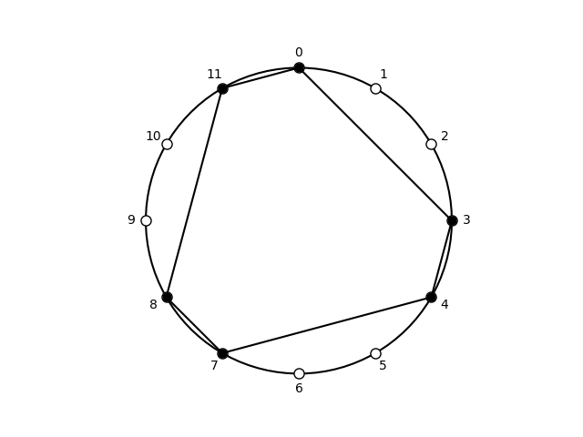

## Subsets of hexatonic, (0, 3, 4, 7, 8, 11)

| pcs | Forte name | prime | sia | ic Vector | Common |
| --- | --- | --- | --- | --- | --- |
|  <03478B>  |  6-20  |  <014589>  |  <3-1-3-1-3-1>  |  <303630>  |  E all combinatorial (P2, P6, P10, I3, I7, R4, R8, RI1, RI5, RI9)  |

## Subsets of cardinality 3

| pcs | Forte name | prime | sia | ic Vector | Common |
| --- | --- | --- | --- | --- | --- |
|  <034>  |  3-3B  |  <014>  |  <3-1-8>  |  <101100>  |  major-minor trichord  |
|  <037>  |  3-11A  |  <037>  |  <3-4-5>  |  <001110>  |  minor triad  |
|  <038>  |  3-11B  |  <037>  |  <3-5-4>  |  <001110>  |  major triad  |
|  <03B>  |  3-3A  |  <014>  |  <3-8-1>  |  <101100>  |  major-minor trichord  |
|  <047>  |  3-11B  |  <037>  |  <4-3-5>  |  <001110>  |  major triad  |
|  <048>  |  3-12  |  <048>  |  <4-4-4>  |  <000300>  |  augmented triad  |
|  <04B>  |  3-4A  |  <015>  |  <4-7-1>  |  <100110>  |  incomplete major-seventh chord  |
|  <078>  |  3-4A  |  <015>  |  <7-1-4>  |  <100110>  |  incomplete major-seventh chord  |
|  <07B>  |  3-4B  |  <015>  |  <7-4-1>  |  <100110>  |  incomplete major-seventh chord  |
|  <08B>  |  3-3B  |  <014>  |  <8-3-1>  |  <101100>  |  major-minor trichord  |
|  <347>  |  3-3A  |  <014>  |  <1-3-8>  |  <101100>  |  major-minor trichord  |
|  <348>  |  3-4A  |  <015>  |  <1-4-7>  |  <100110>  |  incomplete major-seventh chord  |
|  <34B>  |  3-4B  |  <015>  |  <1-7-4>  |  <100110>  |  incomplete major-seventh chord  |
|  <378>  |  3-4B  |  <015>  |  <4-1-7>  |  <100110>  |  incomplete major-seventh chord  |
|  <37B>  |  3-12  |  <048>  |  <4-4-4>  |  <000300>  |  augmented triad  |
|  <38B>  |  3-11A  |  <037>  |  <5-3-4>  |  <001110>  |  minor triad  |
|  <478>  |  3-3B  |  <014>  |  <3-1-8>  |  <101100>  |  major-minor trichord  |
|  <47B>  |  3-11A  |  <037>  |  <3-4-5>  |  <001110>  |  minor triad  |
|  <48B>  |  3-11B  |  <037>  |  <4-3-5>  |  <001110>  |  major triad  |
|  <78B>  |  3-3A  |  <014>  |  <1-3-8>  |  <101100>  |  major-minor trichord  |

Summary: 3-3A: 3, 3-3B: 3, 3-4A: 3, 3-4B: 3, 3-11A: 3, 3-11B: 3, 3-12: 2.

## Subsets of cardinality 4

| pcs | Forte name | prime | sia | ic Vector | Common |
| --- | --- | --- | --- | --- | --- |
|  <0347>  |  4-17  |  <0347>  |  <3-1-3-5>  |  <102210>  |  major-minor tetramirror  |
|  <0348>  |  4-19B  |  <0148>  |  <3-1-4-4>  |  <101310>  |  augmented major tetrachord  |
|  <034B>  |  4-7  |  <0145>  |  <3-1-7-1>  |  <201210>  |  Arabian tetramirror  |
|  <0378>  |  4-20  |  <0158>  |  <3-4-1-4>  |  <101220>  |  major seventh chord  |
|  <037B>  |  4-19A  |  <0148>  |  <3-4-4-1>  |  <101310>  |  minor-augmented tetrachord  |
|  <038B>  |  4-17  |  <0347>  |  <3-5-3-1>  |  <102210>  |  major-minor tetramirror  |
|  <0478>  |  4-19B  |  <0148>  |  <4-3-1-4>  |  <101310>  |  augmented major tetrachord  |
|  <047B>  |  4-20  |  <0158>  |  <4-3-4-1>  |  <101220>  |  major seventh chord  |
|  <048B>  |  4-19B  |  <0148>  |  <4-4-3-1>  |  <101310>  |  augmented major tetrachord  |
|  <078B>  |  4-7  |  <0145>  |  <7-1-3-1>  |  <201210>  |  Arabian tetramirror  |
|  <3478>  |  4-7  |  <0145>  |  <1-3-1-7>  |  <201210>  |  Arabian tetramirror  |
|  <347B>  |  4-19A  |  <0148>  |  <1-3-4-4>  |  <101310>  |  minor-augmented tetrachord  |
|  <348B>  |  4-20  |  <0158>  |  <1-4-3-4>  |  <101220>  |  enharmonic equivalent to major seventh chord  |
|  <378B>  |  4-19A  |  <0148>  |  <4-1-3-4>  |  <101310>  |  minor-augmented tetrachord  |
|  <478B>  |  4-17  |  <0347>  |  <3-1-3-5>  |  <102210>  |  major-minor tetramirror  |

Summary: 4-7: 3, 4-17: 3, 4-19A: 3, 4-19B: 3, 4-20: 3.

## Subsets of cardinality 5

| pcs | Forte name | prime | sia | ic Vector | Common |
| --- | --- | --- | --- | --- | --- |
|  <03478>  |  5-21B  |  <01458>  |  <3-1-3-1-4>  |  <202420>  |  Lebanese pentachord  |
|  <0347B>  |  5-21A  |  <01458>  |  <3-1-3-4-1>  |  <202420>  |  major-augmented ninth chord  |
|  <0348B>  |  5-21B  |  <01458>  |  <3-1-4-3-1>  |  <202420>  |  Lebanese pentachord  |
|  <0378B>  |  5-21A  |  <01458>  |  <3-4-1-3-1>  |  <202420>  |  major-augmented ninth chord  |
|  <0478B>  |  5-21B  |  <01458>  |  <4-3-1-3-1>  |  <202420>  |  Lebanese pentachord  |
|  <3478B>  |  5-21A  |  <01458>  |  <1-3-1-3-4>  |  <202420>  |  major-augmented ninth chord  |

Summary: 5-21A: 3, 5-21B: 3.

