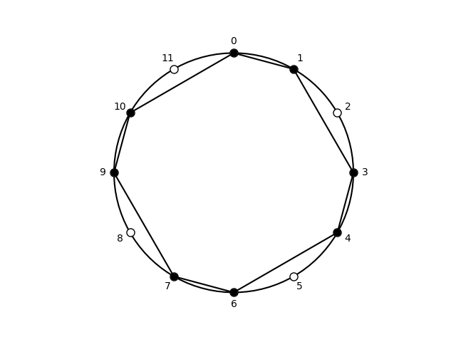

## Subsets of octatonic, [0, 1, 3, 4, 6, 7, 9, 10]

| pcs | Forte name | prime | sia | ic Vector | Common |
| --- | --- | --- | --- | --- | --- |
|  <0134679A>  |  8-28  |  <0134679A>  |  <1-2-1-2-1-2-1-2>  |  <448444>  |  octatonic scale  |

## Subsets of cardinality: 3

| pcs | Forte name | prime | sia | ic Vector | Common |
| --- | --- | --- | --- | --- | --- |
|  <013>  |  3-2A  |  <013>  |  <1-2-9>  |  <111000>  |  phrygian trichord  |
|  <014>  |  3-3A  |  <014>  |  <1-3-8>  |  <101100>  |  major-minor trichord  |
|  <016>  |  3-5A  |  <016>  |  <1-5-6>  |  <100011>  |  tritone-fourth  |
|  <017>  |  3-5B  |  <016>  |  <1-6-5>  |  <100011>  |  tritone-fourth  |
|  <019>  |  3-3B  |  <014>  |  <1-8-3>  |  <101100>  |  major-minor trichord  |
|  <01A>  |  3-2B  |  <013>  |  <1-9-2>  |  <111000>  |  minor trichord  |
|  <034>  |  3-3B  |  <014>  |  <3-1-8>  |  <101100>  |  major-minor trichord  |
|  <036>  |  3-10  |  <036>  |  <3-3-6>  |  <002001>  |  diminished triad  |
|  <037>  |  3-11A  |  <037>  |  <3-4-5>  |  <001110>  |  minor triad  |
|  <039>  |  3-10  |  <036>  |  <3-6-3>  |  <002001>  |  diminished triad  |
|  <03A>  |  3-7A  |  <025>  |  <3-7-2>  |  <011010>  |  incomplete minor-seventh chord  |
|  <046>  |  3-8B  |  <026>  |  <4-2-6>  |  <010101>  |  incomplete half-diminished seventh chord  |
|  <047>  |  3-11B  |  <037>  |  <4-3-5>  |  <001110>  |  major triad  |
|  <049>  |  3-11A  |  <037>  |  <4-5-3>  |  <001110>  |  minor triad  |
|  <04A>  |  3-8A  |  <026>  |  <4-6-2>  |  <010101>  |  incomplete dominant-seventh chord  |
|  <067>  |  3-5A  |  <016>  |  <6-1-5>  |  <100011>  |  tritone-fourth  |
|  <069>  |  3-10  |  <036>  |  <6-3-3>  |  <002001>  |  diminished triad  |
|  <06A>  |  3-8B  |  <026>  |  <6-4-2>  |  <010101>  |  incomplete half-diminished seventh chord  |
|  <079>  |  3-7A  |  <025>  |  <7-2-3>  |  <011010>  |  incomplete minor-seventh chord  |
|  <07A>  |  3-7B  |  <025>  |  <7-3-2>  |  <011010>  |  incomplete dominant-seventh chord  |
|  <09A>  |  3-2A  |  <013>  |  <9-1-2>  |  <111000>  |  phrygian trichord  |
|  <134>  |  3-2B  |  <013>  |  <2-1-9>  |  <111000>  |  minor trichord  |
|  <136>  |  3-7A  |  <025>  |  <2-3-7>  |  <011010>  |  incomplete minor-seventh chord  |
|  <137>  |  3-8A  |  <026>  |  <2-4-6>  |  <010101>  |  Italian augmented sixth chord in root position  |
|  <139>  |  3-8B  |  <026>  |  <2-6-4>  |  <010101>  |  incomplete half-diminished seventh chord  |
|  <13A>  |  3-7B  |  <025>  |  <2-7-3>  |  <011010>  |  incomplete dominant-seventh chord  |
|  <146>  |  3-7B  |  <025>  |  <3-2-7>  |  <011010>  |  incomplete dominant-seventh chord  |
|  <147>  |  3-10  |  <036>  |  <3-3-6>  |  <002001>  |  diminished triad  |
|  <149>  |  3-11B  |  <037>  |  <3-5-4>  |  <001110>  |  major triad  |
|  <14A>  |  3-10  |  <036>  |  <3-6-3>  |  <002001>  |  diminished triad  |
|  <167>  |  3-5B  |  <016>  |  <5-1-6>  |  <100011>  |  tritone-fourth  |
|  <169>  |  3-11A  |  <037>  |  <5-3-4>  |  <001110>  |  minor triad  |
|  <16A>  |  3-11B  |  <037>  |  <5-4-3>  |  <001110>  |  major triad  |
|  <179>  |  3-8A  |  <026>  |  <6-2-4>  |  <010101>  |  incomplete dominant-seventh chord  |
|  <17A>  |  3-10  |  <036>  |  <6-3-3>  |  <002001>  |  enharmonic equivalent to diminished triad  |
|  <19A>  |  3-3A  |  <014>  |  <8-1-3>  |  <101100>  |  major-minor trichord  |
|  <346>  |  3-2A  |  <013>  |  <1-2-9>  |  <111000>  |  phrygian trichord  |
|  <347>  |  3-3A  |  <014>  |  <1-3-8>  |  <101100>  |  major-minor trichord  |
|  <349>  |  3-5A  |  <016>  |  <1-5-6>  |  <100011>  |  tritone-fourth  |
|  <34A>  |  3-5B  |  <016>  |  <1-6-5>  |  <100011>  |  tritone-fourth  |
|  <367>  |  3-3B  |  <014>  |  <3-1-8>  |  <101100>  |  major-minor trichord  |
|  <369>  |  3-10  |  <036>  |  <3-3-6>  |  <002001>  |  enharmonic equivalent to diminished triad  |
|  <36A>  |  3-11A  |  <037>  |  <3-4-5>  |  <001110>  |  minor triad  |
|  <379>  |  3-8B  |  <026>  |  <4-2-6>  |  <010101>  |  incomplete half-diminished seventh chord  |
|  <37A>  |  3-11B  |  <037>  |  <4-3-5>  |  <001110>  |  major triad  |
|  <39A>  |  3-5A  |  <016>  |  <6-1-5>  |  <100011>  |  tritone-fourth  |
|  <467>  |  3-2B  |  <013>  |  <2-1-9>  |  <111000>  |  minor trichord  |
|  <469>  |  3-7A  |  <025>  |  <2-3-7>  |  <011010>  |  incomplete minor-seventh chord  |
|  <46A>  |  3-8A  |  <026>  |  <2-4-6>  |  <010101>  |  incomplete dominant-seventh chord  |
|  <479>  |  3-7B  |  <025>  |  <3-2-7>  |  <011010>  |  incomplete dominant-seventh chord  |
|  <47A>  |  3-10  |  <036>  |  <3-3-6>  |  <002001>  |  diminished triad  |
|  <49A>  |  3-5B  |  <016>  |  <5-1-6>  |  <100011>  |  tritone-fourth  |
|  <679>  |  3-2A  |  <013>  |  <1-2-9>  |  <111000>  |  phrygian trichord  |
|  <67A>  |  3-3A  |  <014>  |  <1-3-8>  |  <101100>  |  major-minor trichord  |
|  <69A>  |  3-3B  |  <014>  |  <3-1-8>  |  <101100>  |  major-minor trichord  |
|  <79A>  |  3-2B  |  <013>  |  <2-1-9>  |  <111000>  |  minor trichord  |

Summary: 3-2A: 4, 3-2B: 4, 3-3A: 4, 3-3B: 4, 3-5A: 4, 3-5B: 4, 3-7A: 4, 3-7B: 4, 3-8A: 4, 3-8B: 4, 3-10: 8, 3-11A: 4, 3-11B: 4.

## Subsets of cardinality: 4

| pcs | Forte name | prime | sia | ic Vector | Common |
| --- | --- | --- | --- | --- | --- |
|  <0134>  |  4-3  |  <0134>  |  <1-2-1-8>  |  <212100>  |  alternating tetramirror  |
|  <0136>  |  4-13A  |  <0136>  |  <1-2-3-6>  |  <112011>  |  minor-second diminished tetrachord  |
|  <0137>  |  4-29A  |  <0137>  |  <1-2-4-5>  |  <111111>  |  all-interval tetrachord  |
|  <0139>  |  4-12B  |  <0236>  |  <1-2-6-3>  |  <112101>  |  major-third diminished tetrachord  |
|  <013A>  |  4-10  |  <0235>  |  <1-2-7-2>  |  <122010>  |  minor tetramirror  |
|  <0146>  |  4-15A  |  <0146>  |  <1-3-2-6>  |  <111111>  |  all-interval tetrachord  |
|  <0147>  |  4-18A  |  <0147>  |  <1-3-3-5>  |  <102111>  |  major-diminished tetrachord  |
|  <0149>  |  4-17  |  <0347>  |  <1-3-5-3>  |  <102210>  |  major-minor tetramirror  |
|  <014A>  |  4-12A  |  <0236>  |  <1-3-6-2>  |  <112101>  |  harmonic minor tetrachord  |
|  <0167>  |  4-9  |  <0167>  |  <1-5-1-5>  |  <200022>  |  double tritone tetramirror  |
|  <0169>  |  4-18B  |  <0147>  |  <1-5-3-3>  |  <102111>  |  minor-diminished tetrachord  |
|  <016A>  |  4-29B  |  <0137>  |  <1-5-4-2>  |  <111111>  |  all-interval tetrachord  |
|  <0179>  |  4-15B  |  <0146>  |  <1-6-2-3>  |  <111111>  |  all-interval tetrachord  |
|  <017A>  |  4-13B  |  <0136>  |  <1-6-3-2>  |  <112011>  |  perfect-fourth diminished tetrachord  |
|  <019A>  |  4-3  |  <0134>  |  <1-8-1-2>  |  <212100>  |  alternating tetramirror  |
|  <0346>  |  4-12B  |  <0236>  |  <3-1-2-6>  |  <112101>  |  major-third diminished tetrachord  |
|  <0347>  |  4-17  |  <0347>  |  <3-1-3-5>  |  <102210>  |  major-minor tetramirror  |
|  <0349>  |  4-18B  |  <0147>  |  <3-1-5-3>  |  <102111>  |  minor-diminished tetrachord  |
|  <034A>  |  4-15B  |  <0146>  |  <3-1-6-2>  |  <111111>  |  all-interval tetrachord  |
|  <0367>  |  4-18B  |  <0147>  |  <3-3-1-5>  |  <102111>  |  minor-diminished tetrachord  |
|  <0369>  |  4-28  |  <0369>  |  <3-3-3-3>  |  <004002>  |  diminished seventh chord  |
|  <036A>  |  4-27A  |  <0258>  |  <3-3-4-2>  |  <012111>  |  half-diminished seventh chord  |
|  <0379>  |  4-27A  |  <0258>  |  <3-4-2-3>  |  <012111>  |  half-diminished seventh chord  |
|  <037A>  |  4-26  |  <0358>  |  <3-4-3-2>  |  <012120>  |  minor seventh chord  |
|  <039A>  |  4-13A  |  <0136>  |  <3-6-1-2>  |  <112011>  |  minor-second diminished tetrachord  |
|  <0467>  |  4-29B  |  <0137>  |  <4-2-1-5>  |  <111111>  |  all-interval tetrachord  |
|  <0469>  |  4-27A  |  <0258>  |  <4-2-3-3>  |  <012111>  |  half-diminished seventh chord  |
|  <046A>  |  4-25  |  <0268>  |  <4-2-4-2>  |  <020202>  |  French augmented sixth chord  |
|  <0479>  |  4-26  |  <0358>  |  <4-3-2-3>  |  <012120>  |  minor seventh chord  |
|  <047A>  |  4-27B  |  <0258>  |  <4-3-3-2>  |  <012111>  |  dominant seventh chord  |
|  <049A>  |  4-29A  |  <0137>  |  <4-5-1-2>  |  <111111>  |  all-interval tetrachord  |
|  <0679>  |  4-13A  |  <0136>  |  <6-1-2-3>  |  <112011>  |  minor-second diminished tetrachord  |
|  <067A>  |  4-15A  |  <0146>  |  <6-1-3-2>  |  <111111>  |  all-interval tetrachord  |
|  <069A>  |  4-12B  |  <0236>  |  <6-3-1-2>  |  <112101>  |  major-third diminished tetrachord  |
|  <079A>  |  4-10  |  <0235>  |  <7-2-1-2>  |  <122010>  |  minor tetramirror  |
|  <1346>  |  4-10  |  <0235>  |  <2-1-2-7>  |  <122010>  |  minor tetramirror  |
|  <1347>  |  4-12A  |  <0236>  |  <2-1-3-6>  |  <112101>  |  harmonic minor tetrachord  |
|  <1349>  |  4-29B  |  <0137>  |  <2-1-5-4>  |  <111111>  |  all-interval tetrachord  |
|  <134A>  |  4-13B  |  <0136>  |  <2-1-6-3>  |  <112011>  |  perfect-fourth diminished tetrachord  |
|  <1367>  |  4-15B  |  <0146>  |  <2-3-1-6>  |  <111111>  |  all-interval tetrachord  |
|  <1369>  |  4-27A  |  <0258>  |  <2-3-3-4>  |  <012111>  |  half-diminished seventh chord  |
|  <136A>  |  4-26  |  <0358>  |  <2-3-4-3>  |  <012120>  |  enharmonic equivalent to minor seventh chord  |
|  <1379>  |  4-25  |  <0268>  |  <2-4-2-4>  |  <020202>  |  French augmented sixth chord in first inversion  |
|  <137A>  |  4-27B  |  <0258>  |  <2-4-3-3>  |  <012111>  |  dominant seventh chord  |
|  <139A>  |  4-15A  |  <0146>  |  <2-6-1-3>  |  <111111>  |  all-interval tetrachord  |
|  <1467>  |  4-13B  |  <0136>  |  <3-2-1-6>  |  <112011>  |  perfect-fourth diminished tetrachord  |
|  <1469>  |  4-26  |  <0358>  |  <3-2-3-4>  |  <012120>  |  minor seventh chord  |
|  <146A>  |  4-27B  |  <0258>  |  <3-2-4-3>  |  <012111>  |  dominant seventh chord  |
|  <1479>  |  4-27B  |  <0258>  |  <3-3-2-4>  |  <012111>  |  dominant seventh chord  |
|  <147A>  |  4-28  |  <0369>  |  <3-3-3-3>  |  <004002>  |  diminished seventh chord  |
|  <149A>  |  4-18A  |  <0147>  |  <3-5-1-3>  |  <102111>  |  major-diminished tetrachord  |
|  <1679>  |  4-29A  |  <0137>  |  <5-1-2-4>  |  <111111>  |  all-interval tetrachord  |
|  <167A>  |  4-18A  |  <0147>  |  <5-1-3-3>  |  <102111>  |  major-diminished tetrachord  |
|  <169A>  |  4-17  |  <0347>  |  <5-3-1-3>  |  <102210>  |  major-minor tetramirror  |
|  <179A>  |  4-12A  |  <0236>  |  <6-2-1-3>  |  <112101>  |  harmonic minor tetrachord  |
|  <3467>  |  4-3  |  <0134>  |  <1-2-1-8>  |  <212100>  |  alternating tetramirror  |
|  <3469>  |  4-13A  |  <0136>  |  <1-2-3-6>  |  <112011>  |  minor-second diminished tetrachord  |
|  <346A>  |  4-29A  |  <0137>  |  <1-2-4-5>  |  <111111>  |  all-interval tetrachord  |
|  <3479>  |  4-15A  |  <0146>  |  <1-3-2-6>  |  <111111>  |  all-interval tetrachord  |
|  <347A>  |  4-18A  |  <0147>  |  <1-3-3-5>  |  <102111>  |  major-diminished tetrachord  |
|  <349A>  |  4-9  |  <0167>  |  <1-5-1-5>  |  <200022>  |  double tritone tetramirror  |
|  <3679>  |  4-12B  |  <0236>  |  <3-1-2-6>  |  <112101>  |  major-third diminished tetrachord  |
|  <367A>  |  4-17  |  <0347>  |  <3-1-3-5>  |  <102210>  |  major-minor tetramirror  |
|  <369A>  |  4-18B  |  <0147>  |  <3-3-1-5>  |  <102111>  |  minor-diminished tetrachord  |
|  <379A>  |  4-29B  |  <0137>  |  <4-2-1-5>  |  <111111>  |  all-interval tetrachord  |
|  <4679>  |  4-10  |  <0235>  |  <2-1-2-7>  |  <122010>  |  minor tetramirror  |
|  <467A>  |  4-12A  |  <0236>  |  <2-1-3-6>  |  <112101>  |  harmonic minor tetrachord  |
|  <469A>  |  4-15B  |  <0146>  |  <2-3-1-6>  |  <111111>  |  all-interval tetrachord  |
|  <479A>  |  4-13B  |  <0136>  |  <3-2-1-6>  |  <112011>  |  perfect-fourth diminished tetrachord  |
|  <679A>  |  4-3  |  <0134>  |  <1-2-1-8>  |  <212100>  |  alternating tetramirror  |

Summary: 4-3: 4, 4-9: 2, 4-10: 4, 4-12A: 4, 4-12B: 4, 4-13A: 4, 4-13B: 4, 4-15A: 4, 4-15B: 4, 4-17: 4, 4-18A: 4, 4-18B: 4, 4-25: 2, 4-26: 4, 4-27A: 4, 4-27B: 4, 4-28: 2, 4-29A: 4, 4-29B: 4.

## Subsets of cardinality: 5

| pcs | Forte name | prime | sia | ic Vector | Common |
| --- | --- | --- | --- | --- | --- |
|  <01346>  |  5-10A  |  <01346>  |  <1-2-1-2-6>  |  <223111>  |  alternating pentachord  |
|  <01347>  |  5-16A  |  <01347>  |  <1-2-1-3-5>  |  <213211>  |  major-minor-diminished pentachord  |
|  <01349>  |  5-16B  |  <01347>  |  <1-2-1-5-3>  |  <213211>  |  major-minor diminished pentachord  |
|  <0134A>  |  5-10B  |  <01346>  |  <1-2-1-6-2>  |  <223111>  |  alternating pentachord  |
|  <01367>  |  5-19A  |  <01367>  |  <1-2-3-1-5>  |  <212122>  |  Javanese pentachord  |
|  <01369>  |  5-31A  |  <01369>  |  <1-2-3-3-3>  |  <114112>  |  diminished minor-ninth chord  |
|  <0136A>  |  5-25A  |  <02358>  |  <1-2-3-4-2>  |  <123121>  |  diminished-major ninth chord  |
|  <01379>  |  5-28B  |  <02368>  |  <1-2-4-2-3>  |  <122212>  |  Javanese pentatonic  |
|  <0137A>  |  5-25B  |  <02358>  |  <1-2-4-3-2>  |  <123121>  |  minor-diminished ninth chord  |
|  <0139A>  |  5-10A  |  <01346>  |  <1-2-6-1-2>  |  <223111>  |  alternating pentachord  |
|  <01467>  |  5-19B  |  <01367>  |  <1-3-2-1-5>  |  <212122>  |  Balinese pentachord  |
|  <01469>  |  5-32A  |  <01469>  |  <1-3-2-3-3>  |  <113221>  |  Neapolitan pentachord  |
|  <0146A>  |  5-28A  |  <02368>  |  <1-3-2-4-2>  |  <122212>  |  augmented-sixth pentachord  |
|  <01479>  |  5-32B  |  <01469>  |  <1-3-3-2-3>  |  <113221>  |  Neapolitan pentachord  |
|  <0147A>  |  5-31B  |  <01369>  |  <1-3-3-3-2>  |  <114112>  |  flat-ninth pentachord  |
|  <0149A>  |  5-16A  |  <01347>  |  <1-3-5-1-2>  |  <213211>  |  major-minor-diminished pentachord  |
|  <01679>  |  5-19A  |  <01367>  |  <1-5-1-2-3>  |  <212122>  |  Javanese pentachord  |
|  <0167A>  |  5-19B  |  <01367>  |  <1-5-1-3-2>  |  <212122>  |  Balinese pentachord  |
|  <0169A>  |  5-16B  |  <01347>  |  <1-5-3-1-2>  |  <213211>  |  major-minor diminished pentachord  |
|  <0179A>  |  5-10B  |  <01346>  |  <1-6-2-1-2>  |  <223111>  |  alternating pentachord  |
|  <03467>  |  5-16B  |  <01347>  |  <3-1-2-1-5>  |  <213211>  |  major-minor diminished pentachord  |
|  <03469>  |  5-31A  |  <01369>  |  <3-1-2-3-3>  |  <114112>  |  diminished minor-ninth chord  |
|  <0346A>  |  5-28B  |  <02368>  |  <3-1-2-4-2>  |  <122212>  |  Javanese pentatonic  |
|  <03479>  |  5-32A  |  <01469>  |  <3-1-3-2-3>  |  <113221>  |  Neapolitan pentachord  |
|  <0347A>  |  5-32B  |  <01469>  |  <3-1-3-3-2>  |  <113221>  |  Neapolitan pentachord  |
|  <0349A>  |  5-19A  |  <01367>  |  <3-1-5-1-2>  |  <212122>  |  Javanese pentachord  |
|  <03679>  |  5-31A  |  <01369>  |  <3-3-1-2-3>  |  <114112>  |  diminished minor-ninth chord  |
|  <0367A>  |  5-32A  |  <01469>  |  <3-3-1-3-2>  |  <113221>  |  Neapolitan pentachord  |
|  <0369A>  |  5-31A  |  <01369>  |  <3-3-3-1-2>  |  <114112>  |  diminished minor-ninth chord  |
|  <0379A>  |  5-25A  |  <02358>  |  <3-4-2-1-2>  |  <123121>  |  diminished-major ninth chord  |
|  <04679>  |  5-25A  |  <02358>  |  <4-2-1-2-3>  |  <123121>  |  diminished-major ninth chord  |
|  <0467A>  |  5-28A  |  <02368>  |  <4-2-1-3-2>  |  <122212>  |  augmented-sixth pentachord  |
|  <0469A>  |  5-28B  |  <02368>  |  <4-2-3-1-2>  |  <122212>  |  Javanese pentatonic  |
|  <0479A>  |  5-25B  |  <02358>  |  <4-3-2-1-2>  |  <123121>  |  minor-diminished ninth chord  |
|  <0679A>  |  5-10A  |  <01346>  |  <6-1-2-1-2>  |  <223111>  |  alternating pentachord  |
|  <13467>  |  5-10B  |  <01346>  |  <2-1-2-1-6>  |  <223111>  |  alternating pentachord  |
|  <13469>  |  5-25A  |  <02358>  |  <2-1-2-3-4>  |  <123121>  |  diminished-major ninth chord  |
|  <1346A>  |  5-25B  |  <02358>  |  <2-1-2-4-3>  |  <123121>  |  minor-diminished ninth chord  |
|  <13479>  |  5-28A  |  <02368>  |  <2-1-3-2-4>  |  <122212>  |  augmented-sixth pentachord  |
|  <1347A>  |  5-31B  |  <01369>  |  <2-1-3-3-3>  |  <114112>  |  flat-ninth pentachord  |
|  <1349A>  |  5-19B  |  <01367>  |  <2-1-5-1-3>  |  <212122>  |  Balinese pentachord  |
|  <13679>  |  5-28B  |  <02368>  |  <2-3-1-2-4>  |  <122212>  |  Javanese pentatonic  |
|  <1367A>  |  5-32B  |  <01469>  |  <2-3-1-3-3>  |  <113221>  |  Neapolitan pentachord  |
|  <1369A>  |  5-32A  |  <01469>  |  <2-3-3-1-3>  |  <113221>  |  Neapolitan pentachord  |
|  <1379A>  |  5-28A  |  <02368>  |  <2-4-2-1-3>  |  <122212>  |  augmented-sixth pentachord  |
|  <14679>  |  5-25B  |  <02358>  |  <3-2-1-2-4>  |  <123121>  |  minor-diminished ninth chord  |
|  <1467A>  |  5-31B  |  <01369>  |  <3-2-1-3-3>  |  <114112>  |  flat-ninth pentachord  |
|  <1469A>  |  5-32B  |  <01469>  |  <3-2-3-1-3>  |  <113221>  |  Neapolitan pentachord  |
|  <1479A>  |  5-31B  |  <01369>  |  <3-3-2-1-3>  |  <114112>  |  flat-ninth pentachord  |
|  <1679A>  |  5-16A  |  <01347>  |  <5-1-2-1-3>  |  <213211>  |  major-minor-diminished pentachord  |
|  <34679>  |  5-10A  |  <01346>  |  <1-2-1-2-6>  |  <223111>  |  alternating pentachord  |
|  <3467A>  |  5-16A  |  <01347>  |  <1-2-1-3-5>  |  <213211>  |  major-minor-diminished pentachord  |
|  <3469A>  |  5-19A  |  <01367>  |  <1-2-3-1-5>  |  <212122>  |  Javanese pentachord  |
|  <3479A>  |  5-19B  |  <01367>  |  <1-3-2-1-5>  |  <212122>  |  Balinese pentachord  |
|  <3679A>  |  5-16B  |  <01347>  |  <3-1-2-1-5>  |  <213211>  |  major-minor diminished pentachord  |
|  <4679A>  |  5-10B  |  <01346>  |  <2-1-2-1-6>  |  <223111>  |  alternating pentachord  |

Summary: 5-10A: 4, 5-10B: 4, 5-16A: 4, 5-16B: 4, 5-19A: 4, 5-19B: 4, 5-25A: 4, 5-25B: 4, 5-28A: 4, 5-28B: 4, 5-31A: 4, 5-31B: 4, 5-32A: 4, 5-32B: 4.

## Subsets of cardinality: 6

| pcs | Forte name | prime | sia | ic Vector | Common |
| --- | --- | --- | --- | --- | --- |
|  <013467>  |  6-13  |  <013467>  |  <1-2-1-2-1-5>  |  <324222>  |  alternating hexamirror  |
|  <013469>  |  6-27A  |  <013469>  |  <1-2-1-2-3-3>  |  <225222>  |  combinatorial I (I11)  |
|  <01346A>  |  6-23  |  <023568>  |  <1-2-1-2-4-2>  |  <234222>  |  combinatorial RI (RI8)  |
|  <013479>  |  6-49  |  <013479>  |  <1-2-1-3-2-3>  |  <224322>  |  combinatorial RI (RI4)  |
|  <01347A>  |  6-27B  |  <013469>  |  <1-2-1-3-3-2>  |  <225222>  |  combinatorial I (I1)  |
|  <01349A>  |  6-13  |  <013467>  |  <1-2-1-5-1-2>  |  <324222>  |  alternating hexamirror  |
|  <013679>  |  6-30A  |  <013679>  |  <1-2-3-1-2-3>  |  <224223>  |  Messiaen's truncated mode 2  |
|  <01367A>  |  6-50  |  <014679>  |  <1-2-3-1-3-2>  |  <224232>  |  combinatorial RI (RI1)  |
|  <01369A>  |  6-27A  |  <013469>  |  <1-2-3-3-1-2>  |  <225222>  |  combinatorial I (I11)  |
|  <01379A>  |  6-23  |  <023568>  |  <1-2-4-2-1-2>  |  <234222>  |  combinatorial RI (RI8)  |
|  <014679>  |  6-50  |  <014679>  |  <1-3-2-1-2-3>  |  <224232>  |  combinatorial RI (RI1)  |
|  <01467A>  |  6-30B  |  <013679>  |  <1-3-2-1-3-2>  |  <224223>  |  Stravinsky's Petrushka-chord  |
|  <01469A>  |  6-49  |  <013479>  |  <1-3-2-3-1-2>  |  <224322>  |  combinatorial RI (RI4)  |
|  <01479A>  |  6-27B  |  <013469>  |  <1-3-3-2-1-2>  |  <225222>  |  combinatorial I (I1)  |
|  <01679A>  |  6-13  |  <013467>  |  <1-5-1-2-1-2>  |  <324222>  |  alternating hexamirror  |
|  <034679>  |  6-27A  |  <013469>  |  <3-1-2-1-2-3>  |  <225222>  |  combinatorial I (I11)  |
|  <03467A>  |  6-49  |  <013479>  |  <3-1-2-1-3-2>  |  <224322>  |  combinatorial RI (RI4)  |
|  <03469A>  |  6-30A  |  <013679>  |  <3-1-2-3-1-2>  |  <224223>  |  Messiaen's truncated mode 2  |
|  <03479A>  |  6-50  |  <014679>  |  <3-1-3-2-1-2>  |  <224232>  |  combinatorial RI (RI1)  |
|  <03679A>  |  6-27A  |  <013469>  |  <3-3-1-2-1-2>  |  <225222>  |  combinatorial I (I11)  |
|  <04679A>  |  6-23  |  <023568>  |  <4-2-1-2-1-2>  |  <234222>  |  combinatorial RI (RI8)  |
|  <134679>  |  6-23  |  <023568>  |  <2-1-2-1-2-4>  |  <234222>  |  combinatorial RI (RI8)  |
|  <13467A>  |  6-27B  |  <013469>  |  <2-1-2-1-3-3>  |  <225222>  |  combinatorial I (I1)  |
|  <13469A>  |  6-50  |  <014679>  |  <2-1-2-3-1-3>  |  <224232>  |  combinatorial RI (RI1)  |
|  <13479A>  |  6-30B  |  <013679>  |  <2-1-3-2-1-3>  |  <224223>  |  Stravinsky's Petrushka-chord  |
|  <13679A>  |  6-49  |  <013479>  |  <2-3-1-2-1-3>  |  <224322>  |  combinatorial RI (RI4)  |
|  <14679A>  |  6-27B  |  <013469>  |  <3-2-1-2-1-3>  |  <225222>  |  combinatorial I (I1)  |
|  <34679A>  |  6-13  |  <013467>  |  <1-2-1-2-1-5>  |  <324222>  |  alternating hexamirror  |

Summary: 6-13: 4, 6-23: 4, 6-27A: 4, 6-27B: 4, 6-30A: 2, 6-30B: 2, 6-49: 4, 6-50: 4.

## Subsets of cardinality: 7

| pcs | Forte name | prime | sia | ic Vector | Common |
| --- | --- | --- | --- | --- | --- |
|  <0134679>  |  7-31A  |  <0134679>  |  <1-2-1-2-1-2-3>  |  <336333>  |  alternating heptachord  |
|  <013467A>  |  7-31B  |  <0134679>  |  <1-2-1-2-1-3-2>  |  <336333>  |  diminished scale  |
|  <013469A>  |  7-31A  |  <0134679>  |  <1-2-1-2-3-1-2>  |  <336333>  |  alternating heptachord  |
|  <013479A>  |  7-31B  |  <0134679>  |  <1-2-1-3-2-1-2>  |  <336333>  |  diminished scale  |
|  <013679A>  |  7-31A  |  <0134679>  |  <1-2-3-1-2-1-2>  |  <336333>  |  alternating heptachord  |
|  <014679A>  |  7-31B  |  <0134679>  |  <1-3-2-1-2-1-2>  |  <336333>  |  diminished scale  |
|  <034679A>  |  7-31A  |  <0134679>  |  <3-1-2-1-2-1-2>  |  <336333>  |  alternating heptachord  |
|  <134679A>  |  7-31B  |  <0134679>  |  <2-1-2-1-2-1-3>  |  <336333>  |  diminished scale  |

Summary: 7-31A: 4, 7-31B: 4.

## Supersets of cardinality: 9

| pcs | Forte name | prime | sia | ic Vector | Common |
| --- | --- | --- | --- | --- | --- |
|  <01234679A>  |  9-10  |  <01234679A>  |  <1-1-1-1-2-1-2-1-2>  |  <668664>  |  forte class 9-10  |
|  <01345679A>  |  9-10  |  <01234679A>  |  <1-2-1-1-1-1-2-1-2>  |  <668664>  |  forte class 9-10  |
|  <01346789A>  |  9-10  |  <01234679A>  |  <1-2-1-2-1-1-1-1-2>  |  <668664>  |  forte class 9-10  |
|  <0134679AB>  |  9-10  |  <01234679A>  |  <1-2-1-2-1-2-1-1-1>  |  <668664>  |  forte class 9-10  |

Summary: 9-10: 4.

