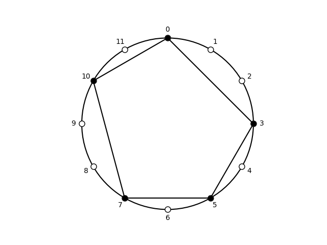

## Subsets of pentatonic, (0, 3, 5, 7, 10)

| pcs | Forte name | prime | sia | ic Vector | Common |
| --- | --- | --- | --- | --- | --- |
|  <0357A>  |  5-35  |  <02479>  |  <3-2-2-3-2>  |  <032140>  |  major pentatonic  |

## Subsets of cardinality 3

| pcs | Forte name | prime | sia | ic Vector | Common |
| --- | --- | --- | --- | --- | --- |
|  <035>  |  3-7B  |  <025>  |  <3-2-7>  |  <011010>  |  incomplete dominant-seventh chord  |
|  <037>  |  3-11A  |  <037>  |  <3-4-5>  |  <001110>  |  minor triad  |
|  <03A>  |  3-7A  |  <025>  |  <3-7-2>  |  <011010>  |  incomplete minor-seventh chord  |
|  <057>  |  3-9  |  <027>  |  <5-2-5>  |  <010020>  |  quartal trichord  |
|  <05A>  |  3-9  |  <027>  |  <5-5-2>  |  <010020>  |  quartal trichord  |
|  <07A>  |  3-7B  |  <025>  |  <7-3-2>  |  <011010>  |  incomplete dominant-seventh chord  |
|  <357>  |  3-6  |  <024>  |  <2-2-8>  |  <020100>  |  whole-tone trichord  |
|  <35A>  |  3-9  |  <027>  |  <2-5-5>  |  <010020>  |  quartal trichord  |
|  <37A>  |  3-11B  |  <037>  |  <4-3-5>  |  <001110>  |  major triad  |
|  <57A>  |  3-7A  |  <025>  |  <2-3-7>  |  <011010>  |  incomplete minor-seventh chord  |

Summary: 3-6: 1, 3-7A: 2, 3-7B: 2, 3-9: 3, 3-11A: 1, 3-11B: 1.

## Subsets of cardinality 4

| pcs | Forte name | prime | sia | ic Vector | Common |
| --- | --- | --- | --- | --- | --- |
|  <0357>  |  4-22B  |  <0247>  |  <3-2-2-5>  |  <021120>  |  perfect-fourth minor tetrachord  |
|  <035A>  |  4-23  |  <0257>  |  <3-2-5-2>  |  <021030>  |  quartal tetramirror  |
|  <037A>  |  4-26  |  <0358>  |  <3-4-3-2>  |  <012120>  |  minor seventh chord  |
|  <057A>  |  4-23  |  <0257>  |  <5-2-3-2>  |  <021030>  |  quartal tetramirror  |
|  <357A>  |  4-22A  |  <0247>  |  <2-2-3-5>  |  <021120>  |  major-second major tetrachord  |

Summary: 4-22A: 1, 4-22B: 1, 4-23: 2, 4-26: 1.

