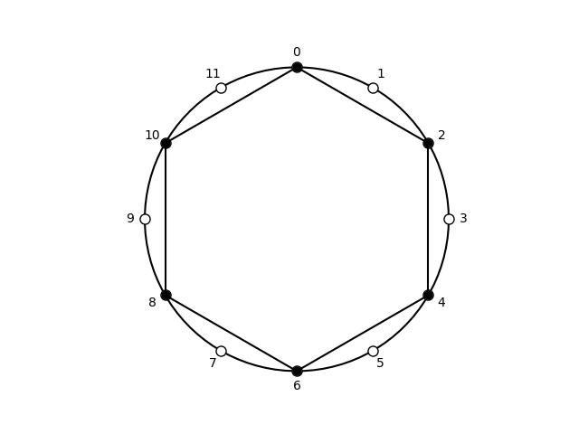

## Subsets of wholetone, [0, 2, 4, 6, 8, 10]

| pcs | Forte name | prime | sia | ic Vector | Common |
| --- | --- | --- | --- | --- | --- |
|  <02468A>  |  6-35  |  <02468A>  |  <2-2-2-2-2-2>  |  <060603>  |  whole tone scale  |

## Subsets of cardinality: 3

| pcs | Forte name | prime | sia | ic Vector | Common |
| --- | --- | --- | --- | --- | --- |
|  <024>  |  3-6  |  <024>  |  <2-2-8>  |  <020100>  |  whole-tone trichord  |
|  <026>  |  3-8A  |  <026>  |  <2-4-6>  |  <010101>  |  incomplete dominant-seventh chord  |
|  <028>  |  3-8B  |  <026>  |  <2-6-4>  |  <010101>  |  incomplete half-diminished seventh chord  |
|  <02A>  |  3-6  |  <024>  |  <2-8-2>  |  <020100>  |  whole-tone trichord  |
|  <046>  |  3-8B  |  <026>  |  <4-2-6>  |  <010101>  |  incomplete half-diminished seventh chord  |
|  <048>  |  3-12  |  <048>  |  <4-4-4>  |  <000300>  |  augmented triad  |
|  <04A>  |  3-8A  |  <026>  |  <4-6-2>  |  <010101>  |  incomplete dominant-seventh chord  |
|  <068>  |  3-8A  |  <026>  |  <6-2-4>  |  <010101>  |  incomplete dominant-seventh chord  |
|  <06A>  |  3-8B  |  <026>  |  <6-4-2>  |  <010101>  |  incomplete half-diminished seventh chord  |
|  <08A>  |  3-6  |  <024>  |  <8-2-2>  |  <020100>  |  whole-tone trichord  |
|  <246>  |  3-6  |  <024>  |  <2-2-8>  |  <020100>  |  whole-tone trichord  |
|  <248>  |  3-8A  |  <026>  |  <2-4-6>  |  <010101>  |  incomplete dominant-seventh chord  |
|  <24A>  |  3-8B  |  <026>  |  <2-6-4>  |  <010101>  |  incomplete half-diminished seventh chord  |
|  <268>  |  3-8B  |  <026>  |  <4-2-6>  |  <010101>  |  incomplete half-diminished seventh chord  |
|  <26A>  |  3-12  |  <048>  |  <4-4-4>  |  <000300>  |  augmented triad  |
|  <28A>  |  3-8A  |  <026>  |  <6-2-4>  |  <010101>  |  incomplete dominant-seventh chord  |
|  <468>  |  3-6  |  <024>  |  <2-2-8>  |  <020100>  |  whole-tone trichord  |
|  <46A>  |  3-8A  |  <026>  |  <2-4-6>  |  <010101>  |  incomplete dominant-seventh chord  |
|  <48A>  |  3-8B  |  <026>  |  <4-2-6>  |  <010101>  |  incomplete half-diminished seventh chord  |
|  <68A>  |  3-6  |  <024>  |  <2-2-8>  |  <020100>  |  whole-tone trichord  |

Summary: 3-6: 6, 3-8A: 6, 3-8B: 6, 3-12: 2.

## Subsets of cardinality: 4

| pcs | Forte name | prime | sia | ic Vector | Common |
| --- | --- | --- | --- | --- | --- |
|  <0246>  |  4-21  |  <0246>  |  <2-2-2-6>  |  <030201>  |  whole-tone tetramirror  |
|  <0248>  |  4-24  |  <0248>  |  <2-2-4-4>  |  <020301>  |  augmented seventh chord  |
|  <024A>  |  4-21  |  <0246>  |  <2-2-6-2>  |  <030201>  |  whole-tone tetramirror  |
|  <0268>  |  4-25  |  <0268>  |  <2-4-2-4>  |  <020202>  |  French augmented sixth chord in third inversion  |
|  <026A>  |  4-24  |  <0248>  |  <2-4-4-2>  |  <020301>  |  augmented seventh chord  |
|  <028A>  |  4-21  |  <0246>  |  <2-6-2-2>  |  <030201>  |  whole-tone tetramirror  |
|  <0468>  |  4-24  |  <0248>  |  <4-2-2-4>  |  <020301>  |  augmented seventh chord  |
|  <046A>  |  4-25  |  <0268>  |  <4-2-4-2>  |  <020202>  |  French augmented sixth chord  |
|  <048A>  |  4-24  |  <0248>  |  <4-4-2-2>  |  <020301>  |  augmented seventh chord  |
|  <068A>  |  4-21  |  <0246>  |  <6-2-2-2>  |  <030201>  |  whole-tone tetramirror  |
|  <2468>  |  4-21  |  <0246>  |  <2-2-2-6>  |  <030201>  |  whole-tone tetramirror  |
|  <246A>  |  4-24  |  <0248>  |  <2-2-4-4>  |  <020301>  |  augmented seventh chord  |
|  <248A>  |  4-25  |  <0268>  |  <2-4-2-4>  |  <020202>  |  French augmented sixth chord in third inversion  |
|  <268A>  |  4-24  |  <0248>  |  <4-2-2-4>  |  <020301>  |  augmented seventh chord  |
|  <468A>  |  4-21  |  <0246>  |  <2-2-2-6>  |  <030201>  |  whole-tone tetramirror  |

Summary: 4-21: 6, 4-24: 6, 4-25: 3.

## Subsets of cardinality: 5

| pcs | Forte name | prime | sia | ic Vector | Common |
| --- | --- | --- | --- | --- | --- |
|  <02468>  |  5-33  |  <02468>  |  <2-2-2-2-4>  |  <040402>  |  whole-tone pentachord  |
|  <0246A>  |  5-33  |  <02468>  |  <2-2-2-4-2>  |  <040402>  |  whole-tone pentachord  |
|  <0248A>  |  5-33  |  <02468>  |  <2-2-4-2-2>  |  <040402>  |  whole-tone pentachord  |
|  <0268A>  |  5-33  |  <02468>  |  <2-4-2-2-2>  |  <040402>  |  whole-tone pentachord  |
|  <0468A>  |  5-33  |  <02468>  |  <4-2-2-2-2>  |  <040402>  |  whole-tone pentachord  |
|  <2468A>  |  5-33  |  <02468>  |  <2-2-2-2-4>  |  <040402>  |  whole-tone pentachord  |

Summary: 5-33: 6.

## Supersets of cardinality: 7

| pcs | Forte name | prime | sia | ic Vector | Common |
| --- | --- | --- | --- | --- | --- |
|  <012468A>  |  7-33  |  <012468A>  |  <1-1-2-2-2-2-2>  |  <262623>  |  Neapolitan-major mode  |
|  <023468A>  |  7-33  |  <012468A>  |  <2-1-1-2-2-2-2>  |  <262623>  |  Neapolitan-major mode  |
|  <024568A>  |  7-33  |  <012468A>  |  <2-2-1-1-2-2-2>  |  <262623>  |  Neapolitan-major mode  |
|  <024678A>  |  7-33  |  <012468A>  |  <2-2-2-1-1-2-2>  |  <262623>  |  Neapolitan-major mode  |
|  <024689A>  |  7-33  |  <012468A>  |  <2-2-2-2-1-1-2>  |  <262623>  |  Neapolitan-major mode  |
|  <02468AB>  |  7-33  |  <012468A>  |  <2-2-2-2-2-1-1>  |  <262623>  |  Neapolitan-major mode  |

Summary: 7-33: 6.

## Supersets of cardinality: 8

| pcs | Forte name | prime | sia | ic Vector | Common |
| --- | --- | --- | --- | --- | --- |
|  <0123468A>  |  8-21  |  <0123468A>  |  <1-1-1-1-2-2-2-2>  |  <474643>  |  forte class 8-21  |
|  <0124568A>  |  8-24  |  <0124568A>  |  <1-1-2-1-1-2-2-2>  |  <464743>  |  forte class 8-24  |
|  <0124678A>  |  8-25  |  <0124678A>  |  <1-1-2-2-1-1-2-2>  |  <464644>  |  Messiaen's mode 6  |
|  <0124689A>  |  8-24  |  <0124568A>  |  <1-1-2-2-2-1-1-2>  |  <464743>  |  forte class 8-24  |
|  <012468AB>  |  8-21  |  <0123468A>  |  <1-1-2-2-2-2-1-1>  |  <474643>  |  forte class 8-21  |
|  <0234568A>  |  8-21  |  <0123468A>  |  <2-1-1-1-1-2-2-2>  |  <474643>  |  forte class 8-21  |
|  <0234678A>  |  8-24  |  <0124568A>  |  <2-1-1-2-1-1-2-2>  |  <464743>  |  forte class 8-24  |
|  <0234689A>  |  8-25  |  <0124678A>  |  <2-1-1-2-2-1-1-2>  |  <464644>  |  Messiaen's mode 6  |
|  <023468AB>  |  8-24  |  <0124568A>  |  <2-1-1-2-2-2-1-1>  |  <464743>  |  forte class 8-24  |
|  <0245678A>  |  8-21  |  <0123468A>  |  <2-2-1-1-1-1-2-2>  |  <474643>  |  forte class 8-21  |
|  <0245689A>  |  8-24  |  <0124568A>  |  <2-2-1-1-2-1-1-2>  |  <464743>  |  forte class 8-24  |
|  <024568AB>  |  8-25  |  <0124678A>  |  <2-2-1-1-2-2-1-1>  |  <464644>  |  Messiaen's mode 6  |
|  <0246789A>  |  8-21  |  <0123468A>  |  <2-2-2-1-1-1-1-2>  |  <474643>  |  forte class 8-21  |
|  <024678AB>  |  8-24  |  <0124568A>  |  <2-2-2-1-1-2-1-1>  |  <464743>  |  forte class 8-24  |
|  <024689AB>  |  8-21  |  <0123468A>  |  <2-2-2-2-1-1-1-1>  |  <474643>  |  forte class 8-21  |

Summary: 8-21: 6, 8-24: 6, 8-25: 3.

## Supersets of cardinality: 9

| pcs | Forte name | prime | sia | ic Vector | Common |
| --- | --- | --- | --- | --- | --- |
|  <01234568A>  |  9-6  |  <01234568A>  |  <1-1-1-1-1-1-2-2-2>  |  <686763>  |  forte class 9-6  |
|  <01234678A>  |  9-8A  |  <01234678A>  |  <1-1-1-1-2-1-1-2-2>  |  <676764>  |  forte class 9-8A  |
|  <01234689A>  |  9-8B  |  <01234678A>  |  <1-1-1-1-2-2-1-1-2>  |  <676764>  |  forte class 9-8B  |
|  <0123468AB>  |  9-6  |  <01234568A>  |  <1-1-1-1-2-2-2-1-1>  |  <686763>  |  forte class 9-6  |
|  <01245678A>  |  9-8B  |  <01234678A>  |  <1-1-2-1-1-1-1-2-2>  |  <676764>  |  forte class 9-8B  |
|  <01245689A>  |  9-12  |  <01245689A>  |  <1-1-2-1-1-2-1-1-2>  |  <666963>  |  Messiaen's mode 3  |
|  <0124568AB>  |  9-8A  |  <01234678A>  |  <1-1-2-1-1-2-2-1-1>  |  <676764>  |  forte class 9-8A  |
|  <01246789A>  |  9-8A  |  <01234678A>  |  <1-1-2-2-1-1-1-1-2>  |  <676764>  |  forte class 9-8A  |
|  <0124678AB>  |  9-8B  |  <01234678A>  |  <1-1-2-2-1-1-2-1-1>  |  <676764>  |  forte class 9-8B  |
|  <0124689AB>  |  9-6  |  <01234568A>  |  <1-1-2-2-2-1-1-1-1>  |  <686763>  |  forte class 9-6  |
|  <02345678A>  |  9-6  |  <01234568A>  |  <2-1-1-1-1-1-1-2-2>  |  <686763>  |  forte class 9-6  |
|  <02345689A>  |  9-8A  |  <01234678A>  |  <2-1-1-1-1-2-1-1-2>  |  <676764>  |  forte class 9-8A  |
|  <0234568AB>  |  9-8B  |  <01234678A>  |  <2-1-1-1-1-2-2-1-1>  |  <676764>  |  forte class 9-8B  |
|  <02346789A>  |  9-8B  |  <01234678A>  |  <2-1-1-2-1-1-1-1-2>  |  <676764>  |  forte class 9-8B  |
|  <0234678AB>  |  9-12  |  <01245689A>  |  <2-1-1-2-1-1-2-1-1>  |  <666963>  |  Messiaen's mode 3  |
|  <0234689AB>  |  9-8A  |  <01234678A>  |  <2-1-1-2-2-1-1-1-1>  |  <676764>  |  forte class 9-8A  |
|  <02456789A>  |  9-6  |  <01234568A>  |  <2-2-1-1-1-1-1-1-2>  |  <686763>  |  forte class 9-6  |
|  <0245678AB>  |  9-8A  |  <01234678A>  |  <2-2-1-1-1-1-2-1-1>  |  <676764>  |  forte class 9-8A  |
|  <0245689AB>  |  9-8B  |  <01234678A>  |  <2-2-1-1-2-1-1-1-1>  |  <676764>  |  forte class 9-8B  |
|  <0246789AB>  |  9-6  |  <01234568A>  |  <2-2-2-1-1-1-1-1-1>  |  <686763>  |  forte class 9-6  |

Summary: 9-6: 6, 9-8A: 6, 9-8B: 6, 9-12: 2.

